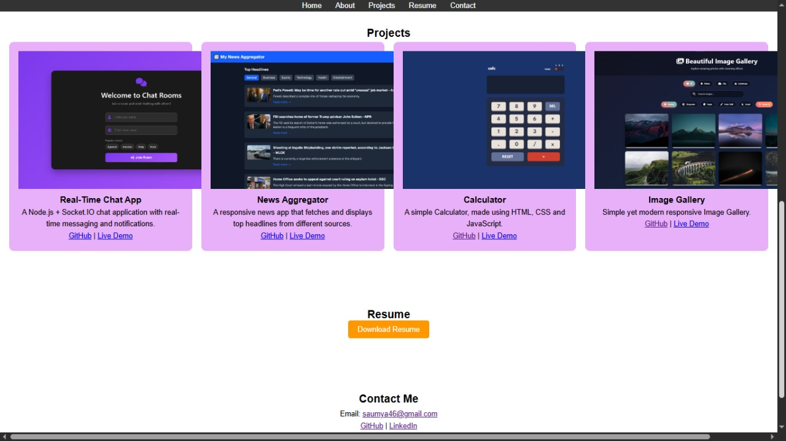

# 🌐 Personal Portfolio Website  

This is my **Personal Portfolio Website** built as part of my **CodeAlpha Internship**.  
It showcases my skills, projects, resume, and contact information in a **clean and responsive layout**.  

---

## 🌍 Live Demo

[🔗View Portfolio](https://saumya-singh-1.github.io/Portfolio_CodeAlpha/)

---
## 🚀 Features  

- ✨ Responsive design (works on desktop & mobile)  
- 📌 Sections: **About Me, Skills, Projects, Resume, Contact**  
- 🎨 Smooth scroll & hover animations  
- 🖼️ Project showcase with **GitHub links + Live Demo**  
- 📄 Downloadable resume button  
- 🌈 Gradient hero section with profile image  

---

## 🛠️ Technologies Used  

- **HTML5** – Structure  
- **CSS3** – Styling, animations, responsiveness  
- **JavaScript** – Interactivity (smooth scroll, animations)  
- **GitHub Pages** – Deployment  

---

## 📸 Screenshots  

### 🔹 Home Section  
  

### 🔹 Projects Section  
  

### 🔹 Responsive View  
  

---

## 📂 Project Structure  

```bash
Portfolio/
│── index.html       # Main HTML file
│── style.css        # Styling
│── assets/
│   ├── images/      # Images & project screenshots
│   └── resume.pdf   # Resume file
```
---

## 📬 Contact

[🔗LinkedIn](https://www.linkedin.com/in/saumya-singh-0256b5378/)
[🔗GitHub](https://github.com/saumya-singh-1)    
